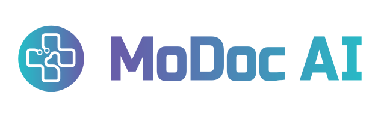

  

  
  
  

---

## 🩺 Who We Are

MoDoc AI builds AI-enhanced digital healthcare tools that help parents navigate their children's health with confidence. We believe no parent should have to sit through a sleepless night wondering if a fever is something serious — so we're building technology that turns worry into informed action.

## 🌡️ Our Flagship: FeverCoach

**FeverCoach** is a smart companion for parents managing childhood fevers and illness.

- **Fever Tracking** — Log temperatures over time and visualize trends at a glance
- **Smart Medication Reminders** — Never miss a dose with timely, weight-based alerts
- **Personalized Health Guidance** — Evidence-based advice tailored to your child's age, weight, and symptoms
- **24/7 AI Coaching** — Get instant, doctor-informed answers when the pediatrician's office is closed

## 🔧 From Our Workshop

| Project | What it does |
| --- | --- |
| [**mr-overkill**](https://github.com/modocai/mr-overkill) | A perfectly over-engineered merge-request review bot. Because code reviews deserve a little drama. |

## 🛠️ Tech We Work With

  
  
  
  
  
  

---

  <i>Empowering families with smarter health tools, one fever at a time.</i> 
  <a href="https://www.modoc-ai.com">www.modoc-ai.com</a>

